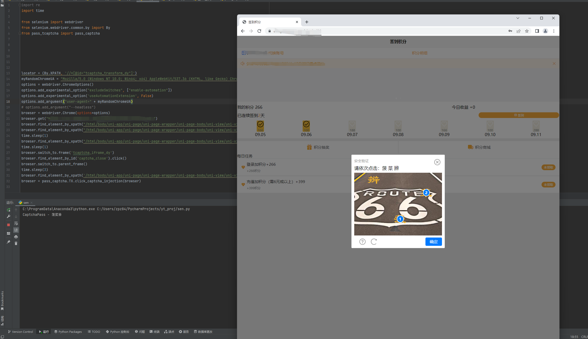
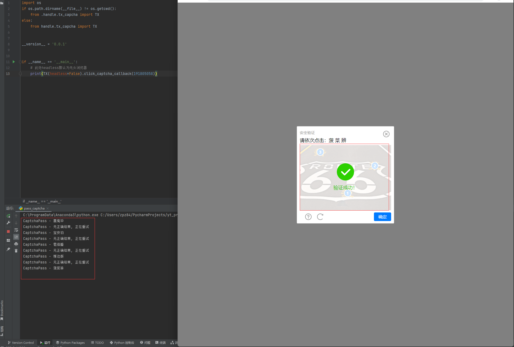
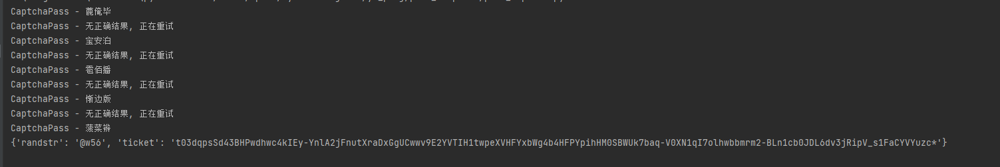
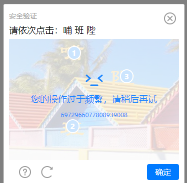
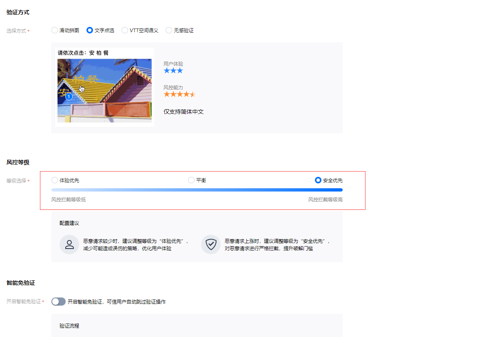

# PassCaptcha
## 推荐使用导入包的形式调用此项目
```angular2html
支持注入方式及返回callback方式通过验证码
当前仅支持腾讯点选验证
```
## 部署
### 0x01 准备 | 难度 1-5
```angular2html
Chrome浏览器(Linux也可正常部署，有疑问联系) | Windows难度: 1 Linux难度: 2
Chrome driver(百度一下，你就知道。注！需对应版本) | 难度: 1
将下载的chromedriver放在你项目的根路径
```
### 0x02 安装
```shell
git clone https://github.com/rrrrat/PassCaptcha.git
pip3 install -r requirements.txt
```

### 0x03 使用
```python
from PassCaptcha import AllPassCaptcha 

# 1.注入方式通过验证
# browser为你的webdriver.Chrome对象, 函数将返回你的浏览器对象
browser = AllPassCaptcha.TX().click_captcha_injection(browser)
# return <object browser>

# 2.callback方式通过验证
# 此处captcha_app_id为对方网站腾讯验证码的APPID(访问网站查看网络内https://t.captcha.qq.com/cap_union_prehandle的aid值)下面会详细说明
randstr, ticket = AllPassCaptcha.TX().click_captcha_callback(captcha_app_id)
# return randstr, ticket
```


## 演示
### 1.注入方式


### 2.callback方式

#### 返回randstr, ticket


## 获取captcha_app_id

```angular2html
aid: 191805058
此处191805058为网站captcha_app_id
```

## 关于操作过于频繁

```angular2html
若网站风控等级过高会出现此类错误，可以尝试自己训练模型提高识别率解决此类问题。
这里大量征集训练数据。
```



## 关于后期更新
```angular2html
加入ALI验证相关规则。
当前无优化思路，欢迎大家给出意见。
```

## 须知
### 不要用191805058测试！！！不要用191805058测试！！！不要用191805058测试！！！
### 该程序仅用于学习用途，禁止用作非法用途！
### 个人维护，不定期更新
### 该程序造成的任何法律责任，财产损失或者人身伤害等问题，本人概不负责！
### 企鹅: 321878646
